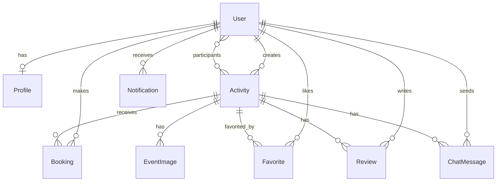

# YatruSathi Backend API

Django REST Framework backend for the YatruSathi travel platform: auth, activities,
destinations, packages, bookings, reviews, favourites, notifications, group chat,
and admin KYC.

> Part of a three-service workspace — see the [root README](../README.md) for the
> full picture.

## Quick start

```bash
python3 -m venv venv && source venv/bin/activate
pip install -r requirements.txt
cp .env.example .env          # set SECRET_KEY at minimum
python manage.py migrate
python manage.py runserver
```

API: `http://localhost:8000/api/` (versioned alias: `/api/v1/`).
Admin: `http://localhost:8000/admin/` — create a user with `python manage.py createsuperuser`.

## Configuration

Copy `.env.example` to `.env` and fill it in. Every value the app reads is listed there.

| Variable | Purpose |
| --- | --- |
| `SECRET_KEY` | Django secret. Required when `DEBUG=False`. |
| `DEBUG` | Defaults to `False`. |
| `ALLOWED_HOSTS` | Comma-separated hostnames. |
| `CORS_ALLOWED_ORIGINS` / `CSRF_TRUSTED_ORIGINS` | Browser origins allowed to call the API. |
| `BACKEND_URL` | Public base URL, used to build absolute media URLs. |
| `RESEND_API_KEY` / `RESEND_FROM_EMAIL` | Transactional email for OTP; SMTP vars are the dev fallback. |

Storage is SQLite (`db.sqlite3` at the project root) — no database server to run.

## Authentication

User endpoints use DRF token auth; admins use a separate JWT scheme. Send the token on
each request:

```
Authorization: Token <your-token>
```

Obtain one from `POST /api/auth/login/` or `POST /api/auth/signup/`.

## Endpoints

Base prefix `/api/` or `/api/v1/`.

| Group | Paths |
| --- | --- |
| Auth | `auth/signup/`, `auth/login/`, `auth/logout/`, `auth/verify-otp/`, `auth/resend-otp/`, `auth/forgot-password/{request-otp,verify-otp,reset}/` |
| Activities | `activities/`, `activities/{id}/`, `activities/{id}/reviews/`, `activities/{id}/chat/` (legacy `events/…` aliases still resolve) |
| Catalogue | `destinations/`, `destinations/{slug}/`, `activity-types/`, `packages/`, `packages/{slug}/`, `package-bookings/`, `dashboard/summary/` |
| Bookings | `bookings/`, `bookings/{id}/`, `bookings/{id}/action/` |
| Social | `reviews/`, `favorites/`, `favorites/{activity_id}/` |
| Notifications | `notifications/`, `notifications/unread-count/`, `notifications/mark-read/`, `notifications/{id}/` |
| Group chat | `groups/`, `groups/{id}/`, `groups/{id}/{mark-read,add-member,remove-member}/`, `groups/{id}/chat/` |
| Admin | `admin/login/`, `admin/kyc-requests/`, `admin/kyc-stats/`, `admin/kyc-requests/{profile_id}/` |
| Users | `users/`, `users/{id}/profile/`, `profile/` |

## Testing

```bash
pytest
```

## Project structure

```
backend/            Django project (settings, urls, wsgi/asgi)
event/
├── models/         Domain models by area (auth, catalog, booking, chat, social, …)
├── serializers/    DRF serializers by domain
├── views/          Class-based views by domain
├── api/            Function views for auth / admin / OTP flows
├── services/       Business logic
├── repositories/   Data-access helpers
├── authentication.py   AdminJWTAuthentication
├── middleware.py
└── tests/          pytest suite
scripts/            build.sh / start.sh / seed_db.py (Render)
requirements/       base.txt · dev.txt · prod.txt
```

## Entity relationships



## Deployment

Configured for Render via `render.yaml`: `scripts/build.sh` installs, collects static
and migrates; `scripts/start.sh` migrates, seeds, and starts Gunicorn. Render's
filesystem is ephemeral — attach a persistent disk or the SQLite data is lost on redeploy.
